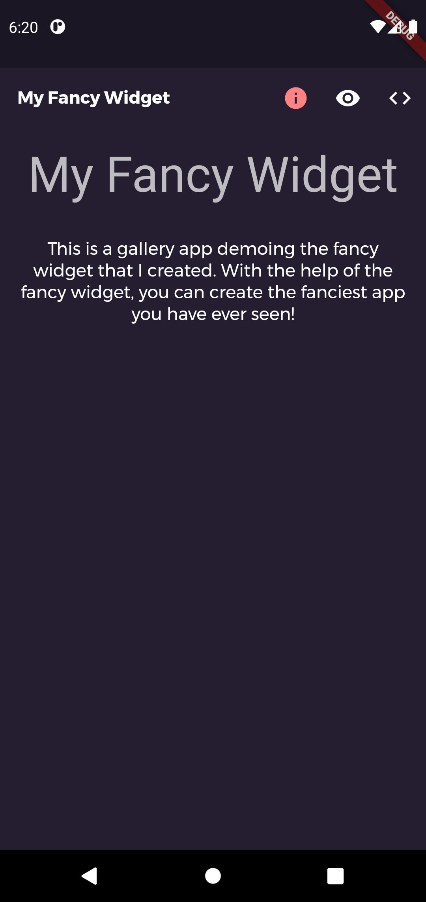
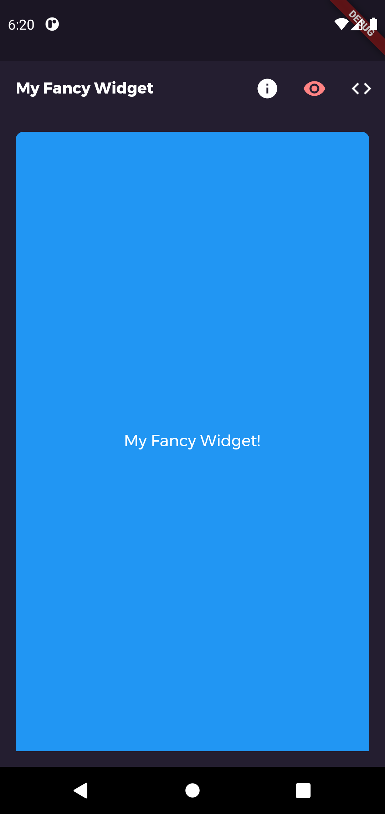
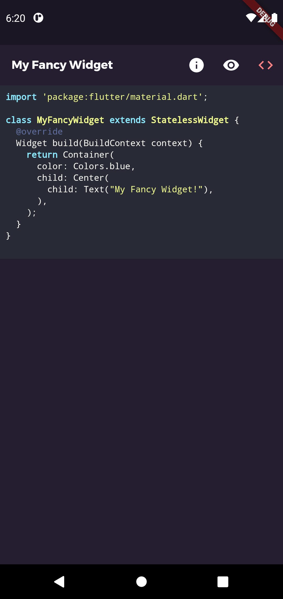

# gallerize

[](https://pub.dev/packages/gallerize)
[](https://github.com/WieFel/gallerize/actions?query=workflow%3Aanalysis)

Flutter package for creating [Flutter Gallery](https://gallery.flutter.dev)-like gallery/demo for your package/widget.


## Purpose of this package

The **gallerize** package can be used to demonstrate what YOUR package/widget is for. It is inspired by [Flutter Gallery](https://gallery.flutter.dev/) ([see repo on GitHub](https://github.com/flutter/gallery)), therefore the name "gallerize".

**gallerize** allows you to take your own package/widget and create an app around it which provides a description, a preview and exemplary source code, just like [Flutter Gallery](https://gallery.flutter.dev/) does it for the material and cupertino widgets. **gallerize** saves you from creating boilerplate code for creating a gallery app structure, importing themes etc.

## Example

Suppose you created an awesome widget (`lib/my_fancy_widget.dart`) which you want to show to your friends/workmates:
```dart
class MyFancyWidget extends StatelessWidget {
  @override
  Widget build(BuildContext context) {
    return Container(
      color: Colors.blue,
      child: Center(
        child: Text("My Fancy Widget!"),
      ),
    );
  }
}
```

Using **gallerize** you can easily create an app that looks as follows:<br/>
 
 


## How to use it?

1. Add dependency to `pubspec.yaml`:
```yaml
dependencies:
  gallerize: <current_version>
```
2. Add all the relevant source files to the `assets` of `pubspec.yaml`:
```yaml
  assets:
    - lib/my_fancy_widget.dart
```
3. Import the **gallerize** package:
```dart
import 'package:gallerize/gallerize.dart';
```
4. Use the `GallerizePage` widget within your app:
```dart
MaterialApp(
  title: 'My Fancy Widget Gallery',
  theme: GallerizeThemeData.darkThemeData,
  home: GallerizePage(
      name: "My Fancy Widget",
      description:
          "This is a gallery app demoing the fancy widget that I created. "
          "With the help of the fancy widget, you can create the "
          "fanciest app you have ever seen!",
      codeFile: "lib/my_fancy_widget.dart",
      preview: MyFancyWidget()),
)
```
`GallerizePage` expects at least a `name` and a `description`, which are shown in the info-tab. `codeFile` is used to tell **gallerize** which dart code to show in the code-tab. `preview` defines the widget that should be shown in the preview-tab.

## Setting the app theme

To change the theme for your gallery-app, you can use two themes offered by **gallerize**, which were taken from [Flutter Gallery](https://gallery.flutter.dev/):
```dart
MaterialApp(
  theme: GallerizeThemeData.darkThemeData,
)
```
The two offered themes are `GallerizeThemeData.darkThemeData` and `GallerizeThemeData.lightThemeData`.

## Changin the syntax highlighting theme

**gallerize** internally uses [flutter_highlight](https://pub.dev/packages/flutter_highlight) for syntax highlighting. See [all available themes](https://github.com/pd4d10/highlight/blob/master/flutter_highlight/lib/themes).

To use a certain syntax highlighting theme, do the following:
1. Import the desired theme (e.g. `a11y-dark.dart`):
```dart
import 'package:flutter_highlight/themes/a11y-dark.dart';
```
2. Set the theme in your `GallerizePage`:
```dart
GallerizePage(
    highlightingTheme: a11yDarkTheme
    ...
)
```
The default theme used is `draculaTheme` (`'package:flutter_highlight/themes/dracula.dart'`)

## TODO
- Github Pages + Github Action Setup - to host the example project, with CD - any push to master branch triggers flutter build web -> commit/createPR to gh-pages branch-> changes reflected to "Github Pages"
- Add "Gallery" Shield - which users can put in their README (https://shields.io/)
- Multi-screen size support (toggle for fullscreen/mobile view)

## Contribute
Check out the [Purpose of gallerize package](https://github.com/WieFel/gallerize/issues/1#issuecomment-709350953) before you begin with any contibution.

1. You'll need a GitHub account.
2. Fork the [gallerize repository](https://github.com/WieFel/gallerize).
3. Pick an issue to work on from the [issue list](https://github.com/WieFel/gallerize/issues).
4. Implement it.
5. Add your name and email in `authors` section in `pubspec.yaml` file. (as soon as `pubspec.yaml` is set up for it...)
6. Create a pull request.
7. Star this project. ⭐
8. Become a hero!! 🎉
